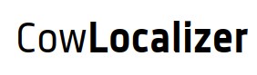

CowLocalizer is a project designed and developed for the monitoring of "animals" without relying on 4G like many other providers.
There are populations where the access of an internet access line with sufficient speed and stability is still not available .So ,keeping such areas in mind, LoRa technology is used in this project, which is a form of data transmission with low consumption and long range.

## Demo


## Installation

Installing Node.

```bash
curl -sL https://deb.nodesource.com/setup_14.x | sudo -E bash -
sudo apt-get install -y nodejs
```
Installing MongoDB
```bash
sudo apt install -y mongodb
npm i express express-handler express-session method-override mongoose passport passport-local bcryptjs connect-flash express-handlebars
npm install dotenv nodemon npm-check-updates -D
```

## Contributing
Pull requests are welcome. For major changes, please open an issue first to discuss what you would like to change.

Please make sure to update tests as appropriate.

